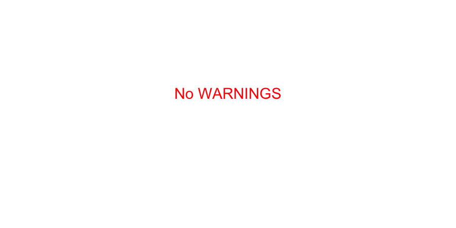

SCBI Dendrometer bands
================

<!-- README.md is generated from README.Rmd. Please edit that file -->

### Data collection errors to resolve

**[Click here to view error
reports.](https://github.com/SCBI-ForestGEO/Dendrobands/tree/master/testthat/reports)**

### warnings?

*These do not cause the tests to fail, but may indicate problems and
should be reviewed.*

### Anomalous measurement report

<!-- -->

## Overview

This repository contains dendrometer bands data for the SCBI ForestGEO
plot. There are two sets of measurements:

1.  *Biannual dendrometer bands* - dendrometer bands on \>500 trees
    measured at start and end of growing season: 2010 - present
2.  *Intra-annual (i.e. biweekly) dendrometer bands* - dendrometer bands
    on \>150 trees measured around every 2 weeks during growing season:
    2011 - present

This data exists in two forms:

1.  [Raw
    data](https://github.com/SCBI-ForestGEO/Dendrobands/tree/master/resources/raw_data/)
    based on field collection forms.
2.  [Post-processed
    data](https://github.com/SCBI-ForestGEO/Dendrobands/tree/master/data/)
    in the `scbi.dendroAll_YEAR.csv` files. This is the data to be used
    for analysis.

Whenever raw data is pushed to GitHub, GitHub Actions continuous
integration follows the steps in
[`.github/workflows/QA_QC_checks.yaml`](https://github.com/SCBI-ForestGEO/Dendrobands/tree/master/.github/workflows/QA_QC_checks.yaml),
which automatically 1) takes the raw data and produces the
post-processed data and 2) performs data QA/QC

To learn how to address both 1) code scripting and 2) data collection
errors identified by GitHub Actions, watch this [screencast training
video](https://sinet-my.sharepoint.com/:v:/g/personal/kimay_si_edu/EQ4BrXfDnk5MrtPihpFc4cYBMmn287nAxw6Rjn4P6Ruifg).

## Sampling location

[SCBI ForestGEO
plot](https://forestgeo.si.edu/sites/north-america/smithsonian-conservation-biology-institute)

## Protocols and data management

1.  *Biannual dendrometer bands* - In 2010, 243 bands were initially
    installed, additional bands were installed in 2011 and currently
    more than 515 stems of various DBH (5.5-152 cm) are being monitored.
    Protocols for band installations and remeasurement are published
    here ([original
    protocol](https://forestgeo.si.edu/sites/default/files/metal_band_dendrometer_protocol_done_1.pdf);
    [latest
    protocol](https://docs.google.com/document/d/1kCG22EAEnOVxw9Z-cPPvrHIzvRFE-j0U7anTmhJbkqM/edit)).
2.  *Intra-annual dendrometer bands* - Since 2011, \~155 stems of DBH
    ranging from 6-148 cm are monitored biweekly during the growing
    season each year.

### Workflow

-   [field_forms](https://github.com/SCBI-ForestGEO/Dendrobands/tree/master/resources/field_forms)
    and
    [raw_data](https://github.com/SCBI-ForestGEO/Dendrobands/tree/master/resources/raw_data)
    are pulled from the year’s master file via R-scripts
-   [maps](https://github.com/SCBI-ForestGEO/Dendrobands/tree/master/resources/maps)
    are generated based on the [current list of trees with
    dendrobands](https://github.com/SCBI-ForestGEO/Dendrobands/blob/master/data/dendro_trees.csv).
-   data recorded in the field are entered in
    [raw_data](https://github.com/SCBI-ForestGEO/Dendrobands/tree/master/resources/raw_data)
    and immediately merged into the current year’s master file using an
    R script.

### Data organization

A dataset for each year of collection is found in the [data
folder](https://github.com/SCBI-ForestGEO/Dendrobands/tree/master/data).
Each year has a master data set that includes both biannual and
intra-annual surveys (with a file name format “scbi.dendroAll_YEAR.csv”)

In the interest of keeping survey data entry simplified, each type of
survey (biannual and intra-annual) has its own .csv for data entry for
the current year. This is where the current year’s data will be entered
during the growing season (March – November). When the growing season is
finished and the November biannual survey is complete, data should be
transferred to the scbi.dendroAll_YEAR.csv via joining/merging in R. 1.
Metadata for these individual forms are consistent with the
scbi.dendroAll_YEAR.csv
[metadata](https://github.com/SCBI-ForestGEO/Dendrobands/blob/master/data/metadata/scbi.dendroALL_%5BYEAR%5D_metadata.csv)
(the master).

## Tree data for dendro trees

A summary of tree species by survey type per year (ie. dbh range) are
available
[here](https://github.com/SCBI-ForestGEO/Dendrobands/tree/master/results/dendro_trees_dbhcount).

Some relevant data on dendrometer banded trees (geographic location,
date started/end, mortalitity year, etc) is available here
[dendro_trees.csv](https://github.com/SCBI-ForestGEO/Dendrobands/blob/master/data/dendro_trees.csv).

## Data Management

Collection of these data is a collaboration between the
Anderson-Teixeira and McShea labs. These data formerly lived on the
McShea V: drive (V:/SIGEO/DENDROMETRY/Dendrobands), and are now managed
in this GitHub repository by the Anderson-Teixeira lab. Access is
provided to any McShea lab member via SCBI-ForestGEO-guest, the password
for which is stored in the V: drive.

## Data use

Contact [Kristina Anderson-Texeira](teixeirak@si.edu)

Note: Also relevant (for code, cross-site integration) is the [ForestGEO
Dendro repository](https://github.com/forestgeo/dendro).

## Contributors

| name                       | GitHub ID    | position\*                          | role                                              |
|----------------------------|--------------|-------------------------------------|---------------------------------------------------|
| Kristina Anderson-Teixeira | teixeirak    | staff scientist, SCBI & STRI        | plot PI                                           |
| William McShea             |              | staff scientist, SCBI               | plot PI                                           |
| Erika Gonzalez-Akre        | gonzalezeb   | lab manager, SCBI                   | oversight of data collection                      |
| Victoria Meakem            |              | research assistant, SCBI            | data collection                                   |
| Ryan Helcoski              | RHelcoski    | research assistant, SCBI            | data collection                                   |
| Ian McGregor               | mcgregorian1 | research assistant, SCBI            | data collection, data organization, coding        |
| Alyssa Terrell             | terrella3    | research assistant, SCBI            | data collection, data organization, coding        |
| Cameron Dow                | camerondow35 | research assistant, SCBI            | data collection, data organization, coding        |
| Albert Y. Kim              | rudeboybert  | research associate, SCBI            | data organization, coding, continuous integration |
| Jess Shue                  | jess-shue    | biological science technician, SERC | data collection, data organization, coding        |
| Jennifer A. Jordan         | jenajordan   | intern, SCBI                        | data collection, data organization                |
| Erin L. MacMonigle         |              | intern, SCBI                        | data collection, data organization                |

\*refers to position at time of main contribution to this repository

\[List does not yet include field assistants/ students/ volunteers who
helped collect data\]

## Funding

ForestGEO

## Contact

Contact Erika Gonzalez-Akre or Albert Y. Kim for any inquiry on
dendroband data collection at SCBI.
