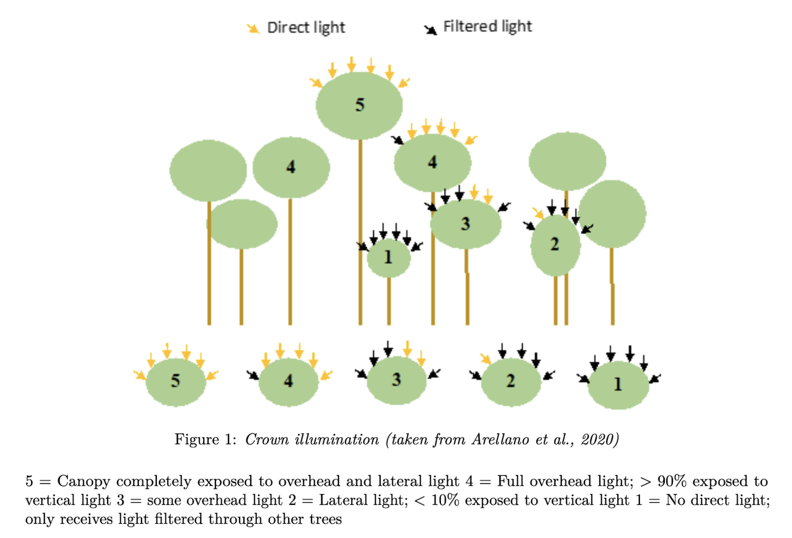

# Workflow for spring dendroband biannual survey

1. Prepare raw-data form to record data in the field.
    1. This file should have been automatically created in `resources/raw_data/YEAR/data_entry_intraannual_YEAR-XX_BLANK.csv` where `XX` is the next survey number
    1. Either print this form or load onto iPad
1. Conduct survey
    1. `codes` column should be based on these [codes](data/metadata/codes_metadata.csv)
    1. For spring biannual survey only also collect `crown.condition` and `crown.illum`: 5-class scale recorded for all trees in mortality census (adopted from dendrobands protocol)  
            
1. Prepare data for GitHub
    1. Rename the raw-data form to `data_entry_intraannual_YEAR-XX.csv` i.e. remove the `_BLANK`
    1. If you printed out form, transfer values to raw-data form
    1. Fill in any remaining columns e.g. `month`, `day`, `field.recorders`, `data.enter`
1. Commit and push `data_entry_intraannual_YEAR-XX.csv`. This will trigger GitHub Actions continuous integration.
1. On the GitHub Actions [workflows page](https://github.com/SCBI-ForestGEO/Dendrobands/actions), you'll see your commit with either
    1. Running 🟡: Code is still running. If so, wait for code to finish running, typically 3 minutes.
    1. Pass ✅: All code successfully ran and no data collection errors were found.
    1. Fail ❌: Either code didn't successfully run or a data collection error was found.
1. If you receive a fail ❌ alert
    1. Click on the commit message, then click on QA_QC_checks
    1. If there is a ❌ alert next to "Are there any data collection errors?", that means there was a data collection error that you'll need to fix.
    1. If there is a ❌ alert anywhere else, that means there was a code error. Contact whoever is the repository code technician for assistance.
1. **Not implemented yet** If there were any data collection errors, fix them:
    1. Go to [`testthat/reports/requires_field_fix`](https://github.com/SCBI-ForestGEO/Dendrobands/blob/master/testthat/reports/requires_field_fix) to inspect the error alerts; an index of what the errors mean can be found in this [table](https://github.com/SCBI-ForestGEO/Dendrobands/blob/master/testthat/README.md) to interpret what the errors mean.
    1. If there are any anomalous measurements on the repository [README](https://github.com/SCBI-ForestGEO/Dendrobands#anomalous-measurement-report), then
        1. Go back into the field and verify this measurement
        1. If the measure was indeed an anomaly, in `data_entry_intraannual_YEAR-XX.csv`, update the date of the measurement and the measurement. If not, then leave entries as is.
        1. In either case, set the `measure_verified` variable to `TRUE`. This will inform the continuous integration systems that this measurement has been double checked.
    1. Commit and push `data_entry_intraannual_YEAR-XX.csv` again
1. **Not sure about this one**: Compare any notes of "dead" trees with the previous year's [mortality census](https://github.com/SCBI-ForestGEO/SCBI-ForestGEO-Data/tree/master/tree_mortality/data).
    1. In general, we want to use the mortality census as the basis for what is live or dead, as it's completed during the growing season.
    1. Trees labeled as dead during the biannual survey may look dead due to the lack of leaves, depending on leaf senescence and recruitment timing.    
1. **Not sure about this one**: Inspect all warnings: [`testthat/reports/warnings`](https://github.com/SCBI-ForestGEO/Dendrobands/blob/master/testthat/reports/warnings)
1. **Not sure about this one**: Update [dendro_trees.csv](https://github.com/SCBI-ForestGEO/Dendrobands/blob/master/data/dendro_trees.csv) with new records of dead trees.

# Previous workflow for spring dendroband biannual survey (prior to 2022)

1. Prepare data sheets for field, and make sure you have a blank raw data form ready for office.
    1. Make sure new "scbi.dendroAll_YEAR" csv is made
    1. Then make field_form_biannual plus data_entry form
    1. Review [checklist](https://github.com/SCBI-ForestGEO/Dendrobands/tree/master/resources/field_forms).
2. Do survey
    1. Double-check no tree is missed. If so, go collect the data the same day or soon thereafter.
    1. Note that for spring biannual survey
3. Enter data in the [raw data form](https://github.com/SCBI-ForestGEO/Dendrobands/tree/master/resources/raw_data), ideally within the same day.
    1. Create a new folder for the current year, and save the raw data form there, calling it "data_entry_biannual_[SURVEYID]".
    1. **BEFORE** merging with the master, push the raw data form and the new folder to Github. This will allow us to compare any discrepancies in the future.
4. Merge to the [master file](https://github.com/SCBI-ForestGEO/Dendrobands/tree/master/data) for that year.
    1. Compare any notes of "dead" trees with the previous year's [mortality census](https://github.com/SCBI-ForestGEO/SCBI-ForestGEO-Data/tree/master/tree_mortality/data).
        1. In general, we want to use the mortality census as the basis for what is live or dead, as it's completed during the growing season.
        1. Trees labeled as dead during the biannual survey may look dead due to the lack of leaves, depending on leaf senescence and recruitment timing.
    1. Fix any data issues that are found.
5. Delete the raw data form you created but keep the folder you made in Step 3a.
6. Update [dendro_trees.csv](https://github.com/SCBI-ForestGEO/Dendrobands/blob/master/data/dendro_trees.csv) with new records of dead trees.
